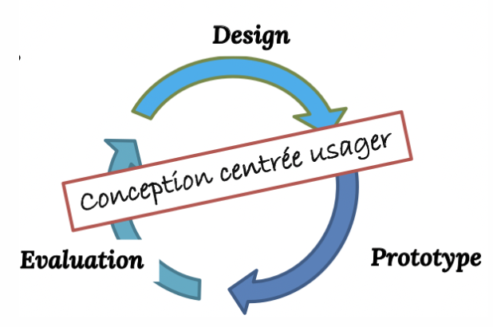
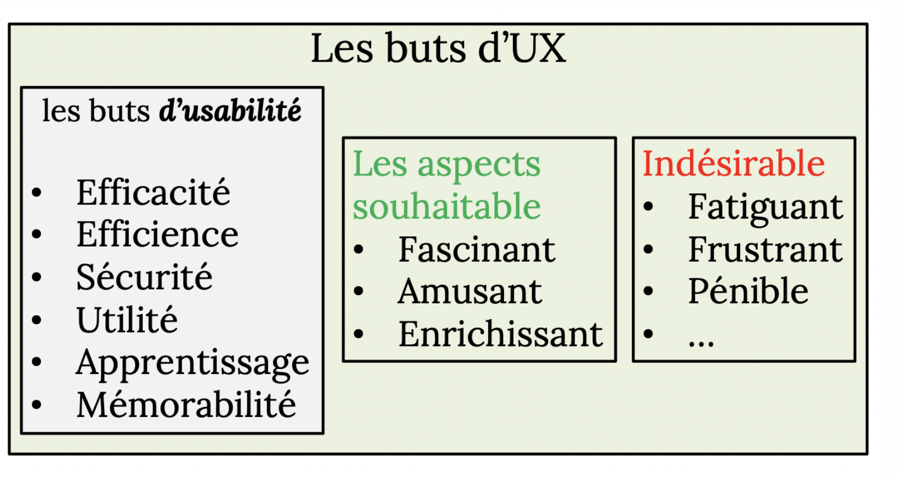

#  HMI Study - Midterm

*Adapted from slides of Prof. Bessmeltsev*, IFT2905 

## Intro

#### Autres types d'interfaces

* Interface humain-objet
* Interface humain-produit

#### Definition: what is a Human-Machine-interface?

In industrial settings, HMIs can be used to:

- Visually display data
- Track production time, trends, and tags
- Oversee KPIs
- Monitor machine inputs and outputs
- And more

#### Common uses of HMIs

HMIs communicate with **Programmable Logic Controllers (PLCs)** and **input/output sensors** to get and display information for users to view. 

**HMI screens can be used for a single function, like monitoring and tracking**, or for performing more sophisticated operations, like switching machines off or increasing production speed, depending on how they are implemented.

-----

#### La question centrale:

Supposons que: 

* l’utilisateur sait ce qu’il veut faire 
* l’objet en est capable

### Est-ce que l’interface permet à l’utilisateur de faire ce qu’il veut?

plus précisement:

### Dans quelle mesure l'interface permet-t- elle à l'utilisateur de faire ce qu'il veut?

----

#### Definition: Usability 

The **degree** to which a product can be **used** by specific users, to accomplish precise goals with effectiveness, effiency *and* satisfaction.

* **Effectiveness:** the product allows the user to reach the end goal that was expected.
* **Efficiency**: the user reaches the end result with as little effort or little time as possible.
* **Satisfaction**: comfort from the user/positive (subjective) feedback about the experience.

#### **The importance of usability**

* The product sells better 

  * The iPhone vs. IBM Simon

* Unusable websites are often abandoned

  * Source of frustration and often source of failure

* Badly used objects can be dangerous 

  

  

#### The responsibility of making something usable

...goes to the designer

#### Mental and physical capabilities of a human user 

- la perception (visuelle, tactile, auditive)
- la mémoire
- l’interprétation des informations cognitifs
- Prise des décisions
- la motricité, i.e., d’interagir physiquement avec les machines

(all but the last one )

##### Examples of theoretical models that simplify and formalize the process of conception that takes into account these cognitive and motor processes (from above)

-----

#### Getting to know the user 

* les objectifs
* les connaissances
* la terminologie
* la façon de travailler
* les éventuelles limitations de perception

##### How do we find this out?

* **Reflection**: think about how hanita would use this UI
* **Observation**: observe hanita using her apps
* **Surveys**: ask hanita why she do this 
* **Usage scenarios:** imagine hypothetical hanita with hypothetical UI

----

### Development and usability

 Analysing to better...

* Understand human performance
* Getting to know the user

###### However, creating a good UI from the first go is highly <u>unlikely</u>

### ...Enter: iterative development 

Design → Prototype → Evaluation

#### Why is it so hard to conceive good UIs?

* You're not the user and can't put yourself in their shoes as a programmer 
* The user is **always** right: recurrent problems are blamed on the system
* ...But the user *isn't* always right: users aren't always designers. They don't always know what's best for them.

---

----

## Performance humaine 

### Perception, mémoire, motricité

##### MOST problems with interfaces are due to the designer not recognizing the <u>limitations and tendency to be wrong</u> of humans

##### → Mistake because of the **DESIGN**, **<u>NOT</u>** human error

### The myth of human error 

Most humans are imperfect & inprevisible 

* Bad memory
* We don't see things that are right there
* We're really confused
* We tire ourselves and become annoying 

### What's actually to blame

* **Functionality** problem : what are the functions of the object? are they doing what i want them to do?
* **Visibility**: what's the current mode? control sequence: what control sequence must I do to obtain what I want?
*  **<u>Feedback</u>**: how do I know if my operations went well? (!!!!)
  * How do i know my button clicked properly??

### Goals of UX (User eXperience)/Usability

### ✨✨✨✨✨✨✨✨✨✨✨✨✨✨✨✨✨✨✨✨✨✨✨✨✨

###   

### **EE<u>SUS</u>M** → **E**fficacity, **E**fficiency, **S**ecurity, **U**sability, **S**implicity of Learning, **M**emorability 

EEEEE *sus* MMMMMMMMM

### ✨✨✨✨✨✨✨✨✨✨✨✨✨✨✨✨✨✨✨✨✨✨✨✨

#### Definition: Usability
The **degree** to which a product can be **used** by specific users, to accomplish precise goals with effectiveness, effiency *and* satisfaction.

* **Effectiveness:** the product allows the user to reach the end goal that was expected.
* **Efficiency**: the user reaches the end result with as little effort or little time as possible.
* **Satisfaction**: comfort from the user/positive (subjective) feedback about the experience.

* **Simplicity of learning**: the ease at which the users get used to and use the surface 
* **Visibility**: the ease to <u>**see** and **understand** the state</u> of the system 
* **Errors**:  measure of the quantitity of these, as well as their impact
* **Memorability** : the capacity to remember how to use the interface

#### Where do designers go wrong? 

* They fail to understand the **range/variety** of **uses** and their **limitations**
* They don't foresee the different **contexts** for use 
* They **don't provide enough detailed instructions** of how to use it 
* They **don't communicate what was done, or don't provide any feedback** at all (lack of feedback)

####  Why is design so hard?

##### Tasks are complex and hard to define 

* the machine doesn't understand the goal of the user
* how to distribute the tasks/responsibilities between the machine and the user? (!!!)

##### Tasks are complex and unpredictable 

* **Users are often indecisive** 
* They use things in unpredictable ways 

##### Tasks are getting more and more complex 

* The **amount** of things to control is increasing constantly(!)
* **Feedback** is more complex, **less natural/intuitive** 
* **Errors ** are more serious/have more ramifications 

##### The pressure of the market 

* Adding functionalities isn't expensive (lies but ok)

* Adding controls/feedback is tho

* Design time is expeez

* Some consumers prefer a cost/visual design(?)

  

#### Definition: Performance & Human cognition 

The set of mental and physical capacities linked to cognitive processes 

**an actual example: ** At which speed can we press a button? 

**<u>not</u> an example:** how long can we survive at -24 C? (unrelated to us being mentally capable or not.)

#### Definition: Cognition 

The set of **mental processes** that contribute to the **functionning of knowledge**

* Acquiring knowledge
* Using knowledge 

##### Different types of knowledge:

* Know-how (procedure)
* Technical knowledge (the facts)
* Languages
* etc.

**Components of cognition**

* Perception
* Language
* Learning
* Memory
* Problem-solving
* Decision-taking
* Attention

#### Man vs. Computer:

##### Pros of hooman: 

- Détection de signal sous bruit

- Reconnaissance de

  configurations (p.e., scènes)

  complexes

- Concentration sur l'essentiel

- Adaptation à des situations

  inattendues

- Aptitude à apprendre

- Mémoriser des informations

  cohérentes

- Intuition

##### Pros of computah

* Détection/reconnaissance de signaux connus

* Réaction **rapide et fiable** aux signaux connus

* Supériorité **si** les problèmes peuvent être formulés algorithmiquement

* Mesurer et compter

 * Stocker de grandes quantités de données incohérentes
 * Répétition fiable et sans fatigue des opérations

#### Motor and sensorial systems 

##### Systèmes sensoriels

- Équilibre et accélération (vestibulaire)
- Conscience du corps
   (proprioception, sens kinesthésique)
- Température
   (réception de chaleur)

##### Systèmes moteurs

- Bras, mains, doigts 
- Tête, yeux
- Système vocal 
- Jambes, pieds, orteils 
- Mâchoire, langue

####  Model human processor (MHP): perceptuel (input), cognitif (processing), moteur (output)
 

Modèle informatique donnant une compréhension abstraite du cycle cognitif 

* perception (***input***)

* traitement (***processing***) 
* action (***output***)

**Trois processeurs avec mémoire associée** 

1. Processeur **perceptuel**

   ​		Capteurs et tampons

   2. Processeur **cognitif**
       		Travail sur contenu de la mémoire de travail

   3. Processeur **moteur** 

      ​	Génère des mouvements

Chaque processeur a un temps d'exécution associé
 Le temps d'exécution globale du système est la somme des trois

#### La perception de couleur

#### Implications pour la perception - lecture

$$
fixation ≈ 230 ms, saccade ≈ 30 ms 
→ ≈250 \text{ms pour 12 lettres}
$$

$$
12 \frac{lettres}{cycle} \rightarrow 48  \frac{lettres}{sec}
$$

$$
5 \frac{lettres}{mot} \rightarrow 600  \frac{mots}{min}
$$

				#### Attention visuelle: summary

**TLDR:** you need to rly pay attention to not miss everything so you really have to keep this in mind for your users. 

* Il y a des lacunes remarquables dans notre perception

* L'interprétation humaine du champ visuel est plus restrictive/clairsemée que ne le suggère l'expérience subjective de "voir".

* La perception des objets nécessite des ressources considérables

   Attention is necessary to see change(!!!!)

* ### Si l'attention est ailleurs, des changements peuvent être manqués

#### Stroop effect (like that lil game in brain age)

---

----

## Principes de design

### Facilité d’apprendre, visibilité, erreurs, efficience

 <- pretty much the holy bible by our lord n savior mr. don norman 

#### 	 Definition: discoverability 
 L'utilisateur peut-il savoir

* ce que le produit fait?

  * comment le produit fonctionne? 
  * quelles opérations sont possibles?

  **TLDR**: <u>can the user figure it out by themselves?</u>

  -----

  

## Key concepts:

#### Capacités d’action (affordances) → you afford a use to it(?)

*Capacité d’action qu'un utilisateur peut effectuer avec un objet*

La <u>**relation**</u> **entre l’utilisateur et l’objet** qui déterminent **<u>comment</u>** l’objet peut être **<u>utilisé</u>**

##### Some affordances are visible, some aren't(!!). Affordances that are visible are the **<u>central indicators</u>** of an object's use, eg a light switch:

##### Affordances in mobile apps → **<u>gestures</u>**

ie: a button is meant to be *tapppppped* (taptaptap) (tap tap revenge)

A wise person once said: 

> **An affordance is something an object (or dashboard) can do.** **A tap/faucet can run hot or cold water, for example.** **A signifier is an indicator of some sort**. In our tap example, this might be red/blue dots signifying which way to turn the tap to get hot or cold water.

#### Anti-affordance

**<u>Some affordance removed on purpose,</u>** ie those benches that dont allow ppl to lie down. In our mobile apps, an example of anti-affordance is the `disabled` attribute on a button 

#### Signifiants (signifiers)

Les ***signifiants*** sont utilisé pour rendre visible les affordances:

* ils indiquent quelles actions sont possibles, et (*souvent*)
* où et comment ils devraient être appliqués

**TLDR:** Signifiers help us make an affordance that's not very obvious to the user, visible. Example: the **hamburger** icon! 

##### **Signalisation**

Plus de signifiants ≠ mieux 

​	→ confusion avec d'autres affordances

​	→ défaut de découvrir l'affordance (we get annoyed seeing so many signs and we just try to figure it out ourselves)

##### →  Our bois the norman doors 

>  The Norman door is basically **any door that's confusing or difficult to use**. 

#### Correspondances (mapping/neural mapping)

> The term **natural mapping** comes from proper and natural arrangements for the relations between controls and their movements to the outcome from such action into the world.  

→ basically a kind of logical relationship between a control and the controlled object..?

**ie**: a driving wheel that turns, steering the car in the spin direction 

##### Correspondance naturelle

Prendre avantage des analogies au monde physique ou aux standards culturels.

ie: 

and

(note how it's the same placement between the burners and their respective switches)

#### Contraintes

##### Physical relationship between elements

Contrainte sur la **<u>relation physique</u>** entre les éléments (!!!!!) 

* principalement lié a la **<u>forme</u>** 

* peut aider si bien fait

* peut nuire si mal fait

  

#### Rétroaction (feedback)

Principe du feedback: on doit montrer à l'usager **l’effet de ses actions** et les résultats qui en découlent.

[self explanatory]

#### Définition: Modèles conceptuels

**Une explication, souvent <u>très simplifiée</u>, de la façon dont quelque chose fonctionne**

→ **Un modèle conceptuel n’a *pas* besoin d’être complet ou même précis** **<u>tant qu’il est utile</u>**

##### Modèle fonctionnel → function: intuition

On sait quoi faire sans savoir pourquoi

##### Modèle structurel → we know the structure/components 

##### Modèles conceptuels sont formés à travers

- des connaissances et hypothèses préexistantes
- interaction avec l'objet 
- explication

#### COMMENT LES GENS FONT LES CHOSES

<iframe width="560" height="315" src="https://www.youtube.com/embed/pAOyWFOFhsg" title="YouTube video player" frameborder="0" allow="accelerometer; autoplay; clipboard-write; encrypted-media; gyroscope; picture-in-picture" allowfullscreen></iframe>

###### Un bon modèle conceptuel est important pour une interaction réussie

- Explique les étapes nécessaires pour atteindre l'objectif
- Attentes d'action-réaction (ou entrée-sortie)
- Interprétation du feedback
- Savoir quoi faire ensuite

###### Et s'il y a des problèmes? Comment savoir si les choses vont mal et où?
###### Nous avons besoin d'en savoir plus sur la façon dont les gens

- décident quoi faire et
- évaluent les résultats

##### Les deux fossés d'interaction 

*Comment les gens choisissent-ils les actions, comment évaluent-ils leurs résultats?*

##### Exemple

*But*: plus de lumière

**Exécution**

*  Intention: allumer la lumière

* Séquence d’actions:

  1. Se lever

  	 2. Aller vers l’interrupteur 
  	 3. Utiliser l’interrupteur

* Exécution

  

***Evaluation***

* Perception
   ̶ combien de lumière?

*  Interprétation
 ̶ il y a plus de lumière

* Evaluation

​	̶  C’est assez de lumière pour lire?

#### Les sept étapes de l'action

- L’utilisateur doit toujours être capable de répondre a ces sept questions
- Difficultés de répondre aux questions indiquent problèmes de design

##### **ANALYSE DE LA CAUSE ORIGINELLE**

L’objectif, est-ce le vrai but ou est-ce un sous-objectif?

- Analyse de la cause originelle 
  - plus de lumière
  - lire un livre de recettes
  -  cuisiner
  - manger 
  - satisfaire la faim

* Les idées disruptives sont souvent trouvées en remettant en question les objectifs, pas les solutions!

**EXEMPLE**

Est-ce qu’on veut
 • acheteruneperceuse?
 • avoiruntroudanslemur?
 • uneétagèrepourleslivres?
 Et pourquoi pas
 • desétagèresquin’ontpasbesoindeperçerdansle

mur?
 • Deslivresquin’ontpasbesoind’étagère?

#### **VISIBILITÉ**

Principe fundamental pour la conception d’interfaces

*Comment combler les deux fossés? Rendre les choses visibles!*

## Les sept principes de design de mr. don norman

1. ##### Découvrabilité:il est possible de déterminer quelles actions sont possibles et quel est l'état du système.

2. ##### Feedback: il y a un feedback complet et continu sur le résultat des actions et l'état actuel du système.

3. ##### Modèle conceptuel: le design affiche toutes les informations nécessaires pour former un bon modèle conceptuel.

4. ##### Affordances: les affordances appropriées existent pour rendre les actions désirées possible

5. ##### Signifiants: l'utilisation correcte des signifiants assure la découvrabilité et que le feedback est bien communiquée.

6. ##### Correspondance: la relation entre les contrôles et leurs actions suit le principe de correspondance naturelle.

7. ##### Contraintes: l’utilisation des contraintes physiques, logiques et sémantiques guide les actions et facilite l'interprétation

---

----

## 

## Techniques de design
### Analyse de tâches, prototypage, tests utilisateur

---

----

## 

## Évaluation
### Conception de tests, statistiques

---

----

## 

## Réalité virtuelle
### Interaction personne-robot